# REACT & REDUX CHEAT SHEET

## SECTION 1 - Let's Dive In!
- INSTALL Create React App Package:

	```
	npm install -g create-react-app
	```

- CREATE New Project

	```
	npx create-react-app <APP_NAME>
	```
	
- START Project

	```
	cd <APP_NAME>
	npm start
	```

- `Babel:` Which is a toolchain that is mainly used to convert ECMAScript 2015+ (ES20015 and newer versions) code into a backwards compatible version of JavaScript in current and older browsers or environments. Babel also converts our JSX code to javascipt code as well.

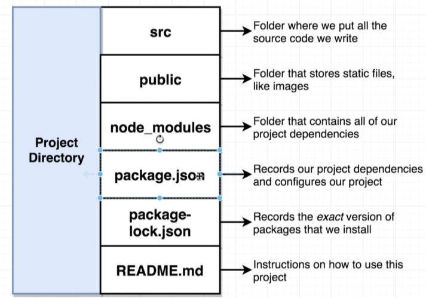


## SECTION 2 - Building Content with JSX
- Babeljs : [Babel Link](https://babeljs.io/)
- Html Versus JSX :
	- One difference is between inline style. JSX uses camelcase style <br/>
	  	__HTML__ `<div style="background-color: red; color: white;"></div>`<br/>
	  	__JSX__  `<div style={{backgroundColor: 'red', color: 'white'}}></div>`
	- Use __className__ insted of __class__
	- JSX can reference JS variable or function
	
		```javascript
		const App = () => {
			const text = 'Some Text';
    		return <div>{text}</div>
		}
		```
		
		```javascript
		const getText = () => {
    		return 'Some Other Text'
		}
		
		const App = () => {
    		return <div>{getText()}</div>
		}
		```
	- Use __htmlFor__ instead of __for__


## SECTION 3 - Communication with Props
- `Props:` Which is a system for passing data from a parent component to a child component. Goal is to customize or configure a child component.<br/>

- Example of props <br/>
	Here is one component :
	
	```javascript
	const SomeComponent = props => {
	    return (
	        <div>
	            <span className="someData">{props.someData}</span>
	        </div>
	    );
	};
	
	export default SomeComponent;
	```
	
	And using that component with props:
	
	```javascript
	import SomeComponent from './SomeComponent'
	
	const SomeOtherComponent = props => {
	    return (
	        <div>
	            <SomeComponent someData='Some Data....'/>
	        </div>
	    );
	};
	
	export default SomeOtherComponent;
	```

- Using of children example with `props.children`: <br/>
	Wrapper Component :
	
	```javascript
 	const SomeWrapperComponent = props => {
	    return (
	        <div className="ui card">
	            <div className="content">{props.children}</div>
	            <div className="extraContent">
	                Some other components or divs...
	            </div>
	        </div>
	    );
	};
	
	export default ApprovalCard;
	```

	Usage of wrapper component:
	
	```javascript
	<SomeWrapperComponent>
        <div>Are you sure you want to do this?</div>
    </SomeWrapperComponent>
	```

## SECTION 4 -  Structuring Apps with Class-Based Components
### Benefits of Class Component:
- Easier code organization
- Can use `state` -> Easier to handle user input
- Understands lifecycle events -> Easier to do things when the app first starts

### Rules of Class Component:
- Must be a JS Class
- Must extend from `React.Component`
- Must define a `render` method that returns some amount of JSX.
- Example of simple class component:

	```javascript
	import React from 'react'
	
	class SomeComponent extends React.Component {
		render() {
			return <div>Some Elements....</div>
		}
	}
	
	export default SomeComponent;
	```
	
- If you want to have a `constructor` you have to give props as argument and pass to super:

	```javascript
	import React from 'react'
	
	class SomeComponent extends React.Component {
		constructor(props) {
			super(props);
		}
		
		render() {
			return <div>Some Elements....</div>
		}
	}
	
	export default SomeComponent;
	```

## SECTION 5 - State in React Components
### Rules of State System in React
- Only usable with class components (Technically can be used with functional components as well with using the __new__ `hooks` system)
- Do __NOT__ confuse `props` with `state`
- `state` is a JS object that contains data relevant to a component
- Updating a `state` on a component causes the component to (almost) instantly rerender
- `state` must be initialized when a component is created
- `state` can __ONLY__ be updated using the function `setState` (For the first time to create state object you can use assignment `this.state = {...})`
- Example of state usage: 

	```javascript
	import React from 'react'
	
	class SomeComponent extends React.Component {
		constructor(props) {
			super(props);
			this.state = {someProp: null}
		}
		
		loadSomething() {
			this.setState({someProp: 'SomeObject'})
		}
		
		render() {
			return <div>Some Elements....</div>
		}
	}
	
	export default SomeComponent;
	```

## SECTION 6 - Understanding Lifecycle Methods
### Component Lifecycle (From Start to End in Time)

```javascript
// (Good place to do one time setup)
constructor(props)

// (Avoid doing anything besides returning JSX)
render()

// (Content visible on screen - Good place to do data-loading)
componentDidMount()

// (Sit and wait for updates)
// Good place to do more data-loading when state/props change
componentDidUpdate()

// (Sit and wait until this component is not longer shown)
// Good place to do cleanup (especially for non-React stuff)
componentWillUnmount()
```

### Other lifecycle methods (rarely used)

```javascript
shouldComponentUpdate()
getDerivedStateFromProps()
getSnapshotBeforeUpdate()
```

### NOTES:
- You don't need to create a constructor if you just want to create initial state object. Example is given below:

	```javascript
	class App extends React.Component {
	    constructor(props) {
	        super(props);
	        this.state = {lat: null, err: ''};
	    }
	}
	
	// is the same with:
	
	class App extends React.Component {
	    state = {lat: null, err: ''};
	
	    ...
	}
	```

- If you want to have default props you can use in two ways:

	- First way:

		```javascript
		// ES6 class
		class CatComponent extends React.Component {
		    constructor(props) {
		      super(props);
		    }
		    render() {
		        return <div>{this.props.catName || "Sandy"}</div>
		    }
		}
		
		// Functional component
		function CatComponent(props) {
		    return <div>{props.catName || "Sandy"}</div>
		}
		```

	- Second way:

		```javascript
		// ES6 class
		class CatComponent extends React.Component {
		    constructor(props) {super(props);}
		    render() {
		        return <div>{this.props.catName}</div>
		    }
		}
		CatComponent.defaultProps = {
		    catName: "Sandy"
		}
		// or
		class CatComponent extends React.Component {
		    constructor(props) {super(props);}
		    static defaultProps = {
		      catName: "Sandy"
		    }
		    render() {
		        return <div>{this.props.catName} </div>
		    }
		}
		// Functional component
		function CatComponent(props) {
		    return <div>{props.catName}</div>
		}
		CatComponent.defaultProps = {
		    catName: "Sandy"   
		}
		```

- __IMPORTANT !!__ -> `setState()` method is not changing whole state object. It is an additive method. It is just changing which we gave:

	```javascript
	class App extends React.Component {
	    state = {lat: null, err: 'ERROR'};
	
	    componentDidMount() {
	        // THAT IS ONLY GOING TO CHANGE lat PROPERTY INSIDE OUR STATE!.
	        // IT IS NOT GOING TO CHANGE err
	        this.setState({lat: 52});
	    }
	    // Other functions, render method...
	}
	```

## SECTION 7 - Handling User Input with Forms and Events
### Some events:
- User clicks on something -> `onClick`
- User changes text in an input -> `onChange`
- User submits a form -> `onSubmit`

### Solving Context Issue for `this` keyword in React

If you see an error like that:

```
TypeError: Cannot read property 'state' of undefined onFormSubmit
src/components/SearchBar.js:8
	
   5 |
   6 | onFormSubmit(event) {
   7 |     event.preventDefault();
>  8 |     console.log(this.state.term);
   9 | ^}
  10 |
  11 | render() {...
```

For given component (for submit of the form - onSubmit function):

```javascript
class SearchBar extends React.Component {
    state = {term: ''};
	
    onFormSubmit(event) {
        event.preventDefault();
        console.log(this.state.term);
    }
	
    render() {
      return (
          <form className='ui form' onSubmit={this.onFormSubmit}>
             // Other JSX div and items
          </form>
      );
    }
}
```

- __1. Solution:__ Add a constructor and bind function with this

	```javascript
	class SearchBar extends React.Component {
	    state = {term: ''};
	
	    constructor(props) {
	        super(props);
	        this.onFormSubmit = this.onFormSubmit.bind(this);
	    }
	
	    onFormSubmit(e) {
	        e.preventDefault();
	        console.log(this.state.term);
	    }
	
	    render() {
	        return (
	            <form className='ui form' onSubmit={this.onFormSubmit}>
	              // Other JSX div and items
	            </form>
	        );
	    }
	}
	```

- __2. Solution (BEST SOLUTION):__ Use arrow function instead of normal function `onFormSubmit = (e) => {}` :

	```javascript
	class SearchBar extends React.Component {
	    state = {term: ''};
	
	    onFormSubmit = (e) => {
	        e.preventDefault();
	        console.log(this.state.term);
	    };
	
	    render() {
	        return (
	            <form className='ui form' onSubmit={this.onFormSubmit}>
	                // Other JSX div and items
	            </form>
	        );
	    }
	}
	```

- __3. Solution:__ Define arrow function in given event parameter:

	```javascript
	class SearchBar extends React.Component {
	    state = {term: ''};
	
	    onFormSubmit(e) {
	        e.preventDefault();
	        console.log(this.state.term);
	    }
	
	    render() {
	        return (
	            <form className='ui form' onSubmit={(e) => this.onFormSubmit(e)}>
	                // Other JSX div and items
	            </form>
	        );
	    }
	}
	```

### NOTES

- Best Practice for call back function naming: `on_TypeOfInput_Event` -(EXAMPLE)-> `onInputChange(event)`

- Creating Event Handler (Do not put any parenthesis at the end of function in any event like onChange):

	```javascript
	onInputChange(event) {
	    console.log(event.target.value);
	}
	
	render() {
	    return (
	        <form className='ui form'>
	            <div className='field'>
	                <label>Image Search</label>
	                <input type='text'
	                className='field'
	                onChange={this.onInputChange}
	            />
	            </div>
	        </form>
	    );
	}
	```
	
- Always use controlled elements (use onChange with value). With that way, we are saying not trust the generated html and always use react state values.

	```javascript	
    <form className='ui form'>
    	<input type='text' 
    	       onChange={e => this.setState({term: e.target.value})}
    	       value={this.state.term}
    	/>
    </form>
	```
		

## SECTION 8 - Making API Requests with React
### Axios vs Fetch
- `axios:` standalone 3rd party package (Good library for API Requests)

	```
	npm install --save axios
	```

- `fetch:` function built into modern browsers (Just a browser function which is getting data)

- There are two ways for the making request

	- First Way (with using `.then(response => ...)` function):

		```javascript
		onSearchSubmit(term) {
		    axios.get('https://api.unsplash.com/search/photos', {
		        params: {
		          query: term
		        },
		        headers: {
		            Authorization: 'Client-ID
		            Hwd5Fh8GY5uNkZNZM2xgm4yOKW28gD8QKKQfuexl4ZE'
		        }
		    }).then((response) => {
		        console.log(response.data.results);
		    })
		}
		```

	- Second Way (with using `async` and `await`keywords):
	
		```javascript
		async onSearchSubmit(term) {
		    const response = await axios.get(
		      'https://api.unsplash.com/search/photos',
		      {
		        params: {
		          query: term
		        },
		        headers: {
		            Authorization: 'Client-ID
		            Hwd5Fh8GY5uNkZNZM2xgm4yOKW28gD8QKKQfuexl4ZE'
		        }
		    });
		
		    console.log(response.data.results);
		}
		```

- Create an axios object with some config and usage: <br/>

	Here is the object creation of axios for specific base url and headers:
	
	```javascript
	import axios from 'axios';
	
	export default axios.create({
	    baseURL: 'https://api.unsplash.com/',
	    headers: {
	        Authorization: 'Client-ID
	        Hwd5Fh8GY5uNkZNZM2xgm4yOKW28gD8QKKQfuexl4ZE'
	    }
	});
	```

	Usage:
	
	```javascript
	onSearchSubmit = async (term) => {
	    const response = await unsplashAxios.get('/search/photos',
	    {
	        params: {query: term}
	    });
	
	    this.setState({images: response.data.results});
	};
	```

### NOTES:

- Convert async function as arrow function: <br/>
	async function:
	
	```javascript
	async onSearchSubmit(term) {
	    const response = await axios.get(
	      'https://api.unsplash.com/search/photos',
	      {
	        params: {query: term},
	        headers: {
	            Authorization: 'Client-ID
	            Hwd5Fh8GY5uNkZNZM2xgm4yOKW28gD8QKKQfuexl4ZE'
	        }
	      }
	    );
		
	    this.setState({images: response.data.results});
	}
	```

	arrow async function :
		
	```javascript
	onSearchSubmit = async (term) => {
	  const response = await axios.get(
	      'https://api.unsplash.com/search/photos',
	      {
	        params: {query: term},
	        headers: {
	            Authorization: 'Client-ID
	            Hwd5Fh8GY5uNkZNZM2xgm4yOKW28gD8QKKQfuexl4ZE'
	        }
	      }
	  );
		
	    this.setState({images: response.data.results});
	};
	```

## SECTION 9 - Building Lists of Records
### Create an list object in React:

```javascript
const ImageList = (props) => {
    const images = props.images.map(image => {
        return 
    });

    return (
      <div> {images} </div>
    );
};

export default ImageList;
```

### NOTES:

Destructor of objects in react (If you don't want to repeat some parameter again and again):

```javascript
const images = props.images.map(image => {
    return 
});
// You can take id description and urls
// from image object directly with {} braces
const images = props.images.map(({id, description, urls}) => {
    return 
});
```

## SECTION 10 - Using Ref's for DOM Access
### React Refs:
- Gives access to a single DOM element
- We create refs in the constructor, assign them to instance variables, then pass to a particular JSX element as props

Example:

```javascript
class ImageCard extends React.Component {
    constructor(props) {
        super(props);
        // 1. Create a React ref
        this.imageRef = React.createRef();
    }

    componentDidMount() {
        this.imageRef.current.addEventListener('load', this.setSpan);
    }

    setSpan = () => {
        let height = this.imageRef.current.clientHeight;
        const spans = Math.ceil(height / 10) + 1;
        this.setState({span: spans});
    };

    render() {
        const {description, urls} = this.props.image;

        return (
            <div style={{gridRowEnd: `span ${this.state.span}`}}>
                // 2. Put created ref to the object
                
            </div>
        );
    }
}

export default ImageCard;
```

## Section 12: Understanding Hooks in React
## Section 13: Navigation From Scratch
## Section 14: Hooks in Practice
## Section 15: Deploying a React App

## SECTION 16 - On We Go...To Redux!
### What is Redux?

- State management library
- Makes creating complex applications easier
- Not required to create React app!
- Not explicitly designed to work with React!

### Redux Cycle:


### Pure Redux Example

Use [CodePen](https://codepen.io/tolgatuna/pen/mdJrOgr) link to run this code and do not forget to add Redux from Settings before running that

```javascript
console.clear();

// --- ACTION CREATORS ---
const createPolicy = (name, amount) => {
  return { // Action for CREATE_POLICY
    type: 'CREATE_POLICY',
    payload: {
      name: name,
      amount: amount
    }
  }
};

const deletePolicy = (name) => {
  return { // Action for DELETE_POLICY
    type: 'DELETE_POLICY',
    payload: {
      name: name
    }
  }
};

const createClaim = (name, amountOfMoneyToCollect) => {
  return { // Action for CREATE_CLAIM
    type: 'CREATE_CLAIM',
    payload: {
      name: name,
      amountOfMoneyToCollect: amountOfMoneyToCollect
    }
  }
};

// --- REDUCERS ---
const claimsHistory = (oldListOfClaims = [], action) => {
  if(action.type === 'CREATE_CLAIM') {
    return [...oldListOfClaims, action.payload]
  }

  return oldListOfClaims;
};

const accounting = (bagOfMoney = 100, action) => {
  if(action.type === 'CREATE_CLAIM') {
    return bagOfMoney - action.payload.amountOfMoneyToCollect;
  } else if (action.type === 'CREATE_POLICY') {
    return bagOfMoney + action.payload.amount;
  }

  return bagOfMoney;
};

const policies = (listOfPolicies = [], action) => {
  if (action.type === 'CREATE_POLICY') {
    return [...listOfPolicies, action.payload];
  } else if (action.type === 'DELETE_POLICY') {
    return listOfPolicies.filter(
      policy => policy.name !== action.payload.name
    )       
  }

  return listOfPolicies;
};

const {createStore, combineReducers} = Redux;
const ourDepartments = combineReducers({
  accounting: accounting,
  claimsHistory: claimsHistory,
  policies: policies
});

const store = createStore(ourDepartments);

// --- TEST OUR CODE ---
store.dispatch(createPolicy('Alex', 20));
store.dispatch(createPolicy('Jim', 30));
store.dispatch(createPolicy('Bob', 40));
console.log(store.getState());

store.dispatch(createClaim('Alex', 120));
store.dispatch(createClaim('Jim', 50));
console.log(store.getState());

store.dispatch(deletePolicy('Bob'));
console.log(store.getState());
```

### Notes:

- An action creator is just a function and it should return json object which should contain `type` and `payload`

- A reducer can be thinkable as State store and responsible from the update any state with an action

- Adding to list with ... (ES2015 syntax) :

```javascript
const numbers = [1, 2, 3];
[...numbers, 4];
// new array will be created and it will be : [1, 2, 3, 4]
// If we say numbers.push(4), this is gonna add 4 to numbers.
// But with ... we are creating brand new array.
```

## SECTION 17 - Integrating React with Redux
### React-Redux

To install redux and react-redux libraries:

```
npm install --save redux react-redux
```

### React-Redux library

- `<Provider/>` makes the Redux store available to any nested components that have been wrapped in the `connect()` function.
- `connect()` is a function which connects a React component to a Redux store.

	`function connect(mapStateToProps?, mapDispatchToProps?, mergeProps?, options?)`
	
	The `mapStateToProps` and `mapDispatchToProps` deals with your Redux store’s state and dispatch, respectively.
	
	The return of `connect()` is a __wrapper function__ that takes your component and returns a __wrapper component__ with the additional props it injects.
	
	- `mapStateToProps?: (state, ownProps?) => Object` : it can take all Redux store’s states and components props __(optional)__ as well.
	- `mapDispatchToProps?: Object | (dispatch, ownProps?) => Object` : it can be directly an object which contains actionCreators or like `mapStateToProps` it can be function which takes dispatch and components props __(optional)__ as well.


### React and Redux How we need to configure ?

- Reducer class should export combined reducers. Reducer actually means store which we are gonna keep our states and also if something changed by an action it needs to update itself.

	```javascript
	import {combineReducers} from "redux";
	
	// SOME OTHER REDUCERS...
	
	const selectItemReducer = (selected = null, action) => {
	    if (action.type === 'SELECT_ITEM') {
	        return action.payload;
	    }
	    return selected;
	};
	
	export default combineReducers({
	    // SOME OTHER REDUCERS...
	    mySelectedItem: selectItemReducer
	});
	```

- Our App component should be covered by a provider which is keeping store in index.js and also `createStore` of `redux` could called with reducers:

	```javascript
	import React from 'react';
	import ReactDOM from 'react-dom';
	import {Provider} from 'react-redux';
	import {createStore} from 'redux';
	import reducers from './reducers';
	import App from './components/App';
	
	ReactDOM.render(
	    <Provider store={createStore(reducers)}>
	        <App/>
	    </Provider>,
	    document.getElementById('root')
	);
	```

- Actions are just functions which returning json object with type (action type) and payload (data).

	```javascript
	// Action Creator
	export const selectSong = (song) => {
	    // Return an action
	    return {
	        type: 'SONG_SELECTED',
	        payload: song
	    }
	};
	```

- A component which wants to connect to our store (Redux side) should be covered with connect (Which is coming from react-redux lib) function

	```javascript
	import React, {Component} from "react";
	import {connect} from "react-redux";
	
	class SongList extends Component {
	    constructor(props) {
	        super(props);
	        console.log(props);
	    }
	    render() {
	        return <div>MyComponent</div>;
	    }
	}
	
	const mapStateToProps = (state) => {
	    //State Contains all store and we are selecting
	    //what we need in that function
	    return {myList: state.list};
	};
	
	export default connect(mapStateToProps)(SongList);
	```

- If A component wants to dispatch some action, it should use an action creator. To use an action creator, it should add mapDispatchToProps array to connect function as second parameter. 

	```javascript
	import React, {Component} from 'react';
	import {connect} from 'react-redux';
	import {selectSong} from '../actions';
		
	class SongComponent extends Component {
	  render() {
	    const {song, selectSong} = this.props;
	    return (
	      <div>
	        <button onClick={() => selectSong(song)}>Select</button>
	      </div>
	    );
	  }
	}
		
	// Function selectSong added as mapDispatchToProps as second parameter.
	export default connect(
	  null,
	  {selectSong}
	)(SongComponent);
	```

### Redux is not a magic!

- Redux does not automatically detect `action creators` being called
- Redux does not automatically detect a function returning an object that is an `action`


## SECTION 18 - Async Actions with Redux Thunk
- Install redux-thunk

	```
	npm install --save redux react-redux axios redux-thunk
	```

	- redux __-->__ The redux library
	- react-redux __-->__ Integration layer between react and redux
	- axios __-->__ Helps us make network request
	- redux-thunk __-->__ Middleware to help us make request in a redux application

### What is Middleware Doing?
__Asynchronous Action Creator:__ Takes some amount of time for it get its data ready to go

#### Redux cycle with middleware :
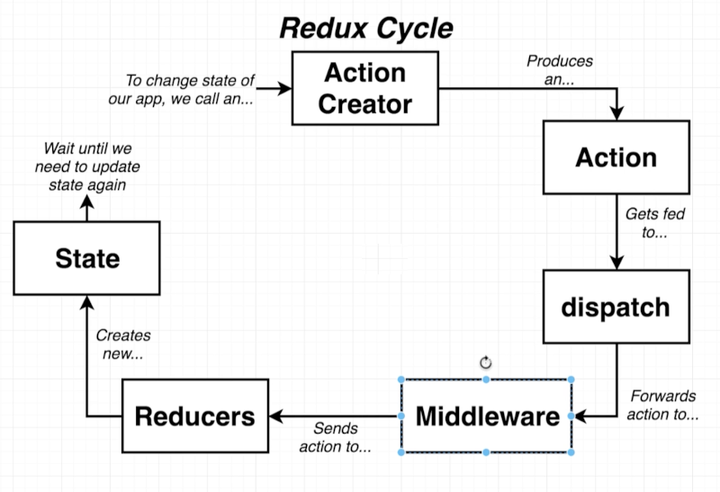

#### Middlaware in Redux
- Function that gets called with every action we dispatch
- Has the ability to `STOP` and `MODIFY`, or otherwise mess around with action
- Tons of open source middleware exist
- Most popular use of middleware is for dealing with async actions
- We are going to use a middleware called `Redux-Thunk` to solve our async issues

### Action Creator Properties
##### Normal Rules for Action Creator
- Action creator **must** return plain JS objects with a `type` property
- Actions must have a `type` property
- Actions can optionally have a `payload`

##### Rules with `Redux-Thunk`
- Action Creators **can** return action objects
**or**
- Action Creators **can** return functions!

#### How Redux-Thunk and Action works together?

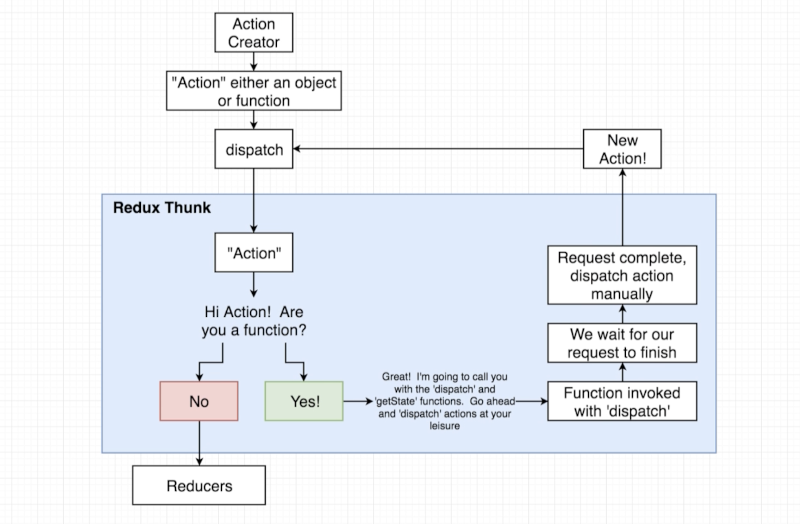

### Implementing thunk in React app

Index file should create store with applyMiddleware and thunk

```javascript
import React from 'react';
import ReactDOM from 'react-dom';
import App from './components/App';
import {Provider} from "react-redux";
import {createStore, applyMiddleware} from "redux";
import reducers from './reducers'
import thunk from 'redux-thunk';

const store = createStore(reducers, applyMiddleware(thunk));

ReactDOM.render(
    <Provider store={store}>
        <App/>
    </Provider>,
    document.getElementById('root')
);
```

Action should return a function which is dispatching our plain object

```javascript
export const fetchPost = () => async dispatch => {
    const promise = await jsonPlaceholder.get('/posts');
    dispatch({type: "FETCH_POST", payload: promise});
};
```

### NOTES
- Arrow Function : <br/>
	__That lots of arrow function__

	```javascript
	export const fetchPost = () => async dispatch => {
	    const promise = await jsonPlaceholder.get('/posts');
	    dispatch({type: "FETCH_POST", payload: promise});
	};
	```
	
	__means__
	
	```javascript
	export const fetchPost = () => {
	    return async dispatch => {
	        const promise = await jsonPlaceholder.get('/posts');
	        dispatch({type: "FETCH_POST", payload: promise});
	    };
	};
	```
	
	__and that means__
	
	```javascript
	export const fetchPost = () => {
	    return async function(dispatch) {
	        const promise = await jsonPlaceholder.get('/posts');
	        dispatch({type: "FETCH_POST", payload: promise});
	    };
	};
	```

- Exact code of redux-thunk :D
	
	```javascript
	function createThunkMiddleware(extraArgument) {
		return ({ dispatch, getState }) => (next) => (action) => {
			if (typeof action === 'function') {
				return action(dispatch, getState, extraArgument);
			}
			
			return next(action);
		};
	}
	
	const thunk = createThunkMiddleware();
	thunk.withExtraArgument = createThunkMiddleware;
	
	export default thunk;
	```
	

## SECTION 19 - Redux Store Design
### Rules of Reducers

- When react application runs with redux, all reducers called with undefined first time. That means all default values setted up at the beginning.
- Must return any value besides 'undefined'
- Produces 'state', or data to be used inside of your app using only previous state and the action (reducers are pure)
- Must not return to react 'out of itself' to decide what value to return

	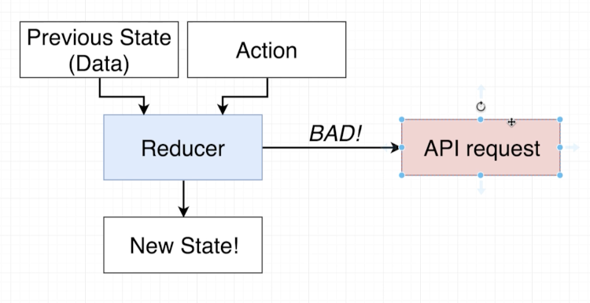
	
- Must not mutate its input 'state' argument

```javascript
export default (state, action) => {
  // BAD!
  state[0] = 'SAM';
  state.pop():
  state.push('SOMETHING'):

  // BAD!
  state.name = 'SAM';
  state.age = 30;

  // Strings and numbers are immutable in JavaScript
  const name = 'SAM';
  name[0] = 'X'
  // if you print name again it is gonna be SAM again.
};
```

- Good way of return new array or an object :


## SECTION 20 - Navigation with React Router

- Install react-router-dom:

	```
	npm install --save react-router-dom
	```

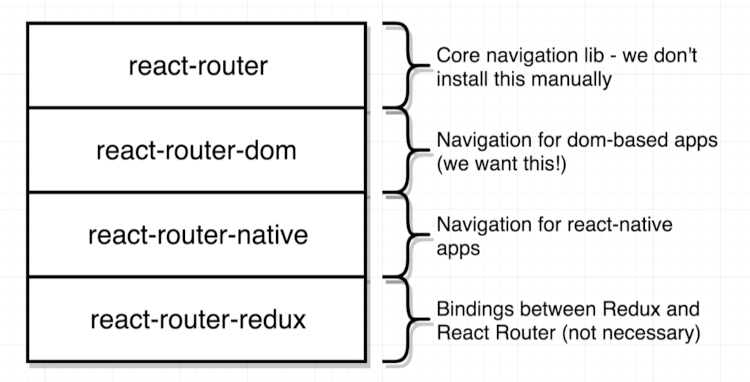

### React Router Simple Usage Example

```JavaScript
import React from 'react';
import {BrowserRouter, Route} from "react-router-dom";

const PageOne = () => {
  return <div>Page One</div>;
};

const PageTwo = () => {
  return <div>Page Two</div>;
};


const App = () => {
  return (
    <BrowserRouter>
      <div>
        <Route path='/' exact component={PageOne}/>
        <Route path='/pagetwo' component={PageTwo}/>
      </div>
    </BrowserRouter>
  );
};

export default App;
```

### How React Router Works

- Paths which are cared by React Router

	

- Simple Diagram of React Router Works

	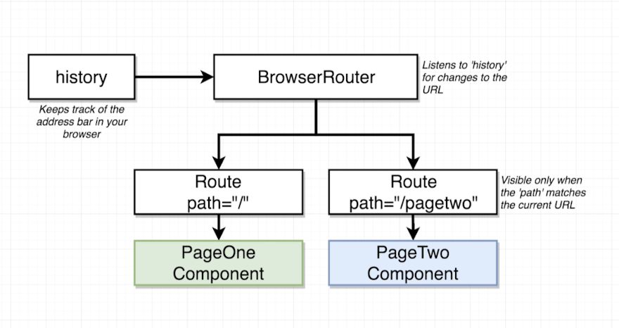

### How Paths Get Matched

Only `/`


`/` and `page`

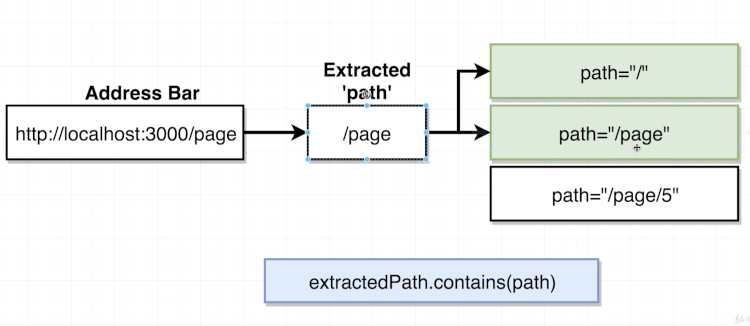

`/` `page` and `5`


### Different Router Types

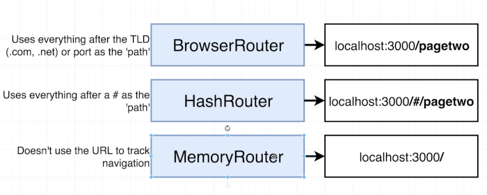

### NOTES
- exact means only display that exactly matched component. On the other hand React will display other components. For example you want to display `/page/5`. If you do not put exact for `/` route, React will display `/` and `/page/5` together. Check the image about `/` `page` and `5`. It is actually matching with all. If you do not put any exact, React will show three elements.
- Never Use `<a>` tag in react app! (If you use anchor tag in your application, you application will start itself again to go that anchor path!). USE `<Link to='...'>` tag! 
- Use single element inside a Router element.
- `<Switch>` looks through all its children `<Route>` elements and renders the first one whose path matches the current URL. Use a `<Switch>` any time you have multiple routes, but you want only one of them to render at a time

## SECTION 21 - Handling Authentication with React
- Project used client side google authentication. Here is an example component for sign in button of google:
	
	```javascript
	import React from "react";
		
	class GoogleAuth extends React.Component {
	  state = {isSignedIn: null}
	  
	  componentDidMount() {
	    window.gapi.load('client:auth2', () => {
	      window.gapi.client.init({
	        clientId: 'YOUR_CLIENT_ID_FOR_AUTH',
	        scope: 'email'
	      }).then(() => {
	        this.auth = window.gapi.auth2.getAuthInstance();
	        this.setState({isSignedIn: this.auth.isSignedIn.get()})
	        this.auth.isSignedIn.listen(() => {
	          this.setState({isSignedIn: this.auth.isSignedIn.get()})
	        })
	      })
	    });
	  }
	  
	  onSignInClicked = () => {
	    this.auth.signIn();
	  }
	  
	  onSignOutClicked = () => {
	    this.auth.signOut();
	  }
	  
	  renderAuthButton() {
	    if (this.state.isSignedIn === null) {
	      return null;
	    } else if (this.state.isSignedIn) {
	      return (
	        <button onClick={this.onSingInClicked} className='ui red google button'>
	          <i className='google icon'/> Sign Out
	        </button>
	      );
	    } else {
	      return (
	        <button onClick={this.onSignOutClicked} className='ui red google button'>
	          <i className='google icon'/> Sign In With Google
	        </button>
	      );
	    }
	  }
	  
	  render() {
	    return this.renderAuthButton();
	  }
	}
	
	export default GoogleAuth;
	```
	
## SECTION 22 - Redux Dev Tool
- [Redux DevTools](https://github.com/zalmoxisus/redux-devtools-extension/) : In chrome check Home -> Extensions -> Redux DevTools and install __Redux DevTools__
- To use tool with any react-redux project, need to add given configuration to react-redux app:
	- import `{applyMiddleware, compose}` from `redux`
	- create func `const composeEnhancers = window.__REDUX_DEVTOOLS_EXTENSION_COMPOSE__ || compose;`
	- use `composeEnhancers` function with `composeEnhancers(applyMiddleware())`
	- Full implementation:

		```javascript
		import {createStore, applyMiddleware, compose} from "redux";
			
		const composeEnhancers = window.__REDUX_DEVTOOLS_EXTENSION_COMPOSE__ || compose;
		
		ReactDOM.render(
			<Provider store={createStore(reducers, composeEnhancers(applyMiddleware()))}>
				<App/>
			</Provider>,
			document.getElementById('root')
		);
		```
- Debug Session with Redux Dev Tools: `localhost:3000?debug_session=<SOME_STRING>`, with that usage if you refresh you page with same `<SOME_STRING>`, tool will continue from your given session.

## SECTION 23 - Handling Forms with Redux Form
- Install redux-form:

	```
	npm install --save redux-form
	```
	
- Documentation: [Redux Form Link](https://redux-form.com/)
	
	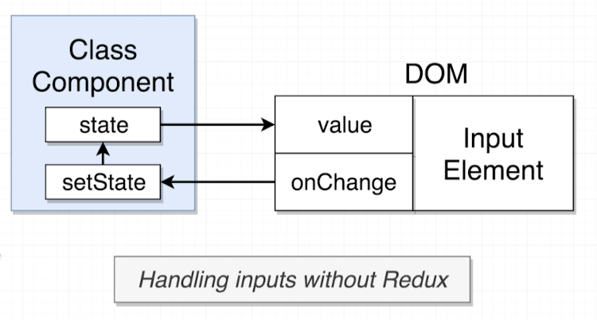

	

- To use redux form 
	- First need to put redux-form `reducer` with specific name `form` into reducers:

		```javascript
		import {combineReducers} from 'redux';
		import {reducer as formReducer} from 'react-form';
		
		export default combineReducers({
		  // Other Reducers....
		  form: formReducer,
		  //... Some Other Reducers....
		})
		```
		
	- Secondly surround component with `reduxForm` function like `connect` function:
	
		```javascript
		import React, {Component} from "react";
		import {Field, reduxForm} from "redux-form";
		
		class MyComponent extends Component {
		  render() {
		    return <div> Will Be Form...</div>;
		  }
		}
			
		export default reduxForm({
		  form: 'GiveANameForYourForm'
		})(MyComponent);
		```
		
- Simple usage:

	```javascript
	import React, {Component} from "react";
	import {Field, reduxForm} from "redux-form";
		
	class MyComponent extends Component {
	  renderInput(fieldProps) {
	    return (
	      <input
	        onChange={fieldProps.input.onChange}
	        value={fieldProps.input.value}
	      />
	    );
	  }
	  
	  render() {
	    return (
	      <form>
	        <Field name='title' component={this.renderInput}/>
	      </form>
	    );
	  }
	}
		
	export default reduxForm({
	  form: 'myComponentForm'
	})(MyComponent);
	```
	
- Don't need to write `onChange={fieldProps.input.onChange}` and `value={fieldProps.input.value}` manually:
	
	```javascript
	renderInput(fieldProps) {
		return <input {... fieldProps.input}/>;
	}
	```
	
	__or more basically__
	
	```javascript
	renderInput({input}) {
		return <input {...input}/>;
	}
	```
- Don't need to write `event.preventDefault()` for form `submit` :
	
	```javascript
	onSubmit(formValues) {
		// Directly form values will come.
	}
		
	render() {
		return (
			<form conSubmit={this.props.handleSubmit(this.onSubmit)}>
				// Other fields....
				<button type="submit">Submit</button>
			</form>
		);
	}
	```
- Validation:
	
	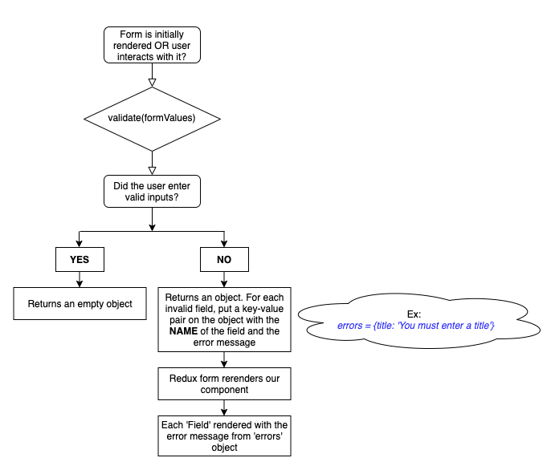

	- Create a validate function and give as parameter to `reduxForm` as `validate`
	- Returns an errors object. If there is no error return `{}` empty object.

		```javascript
		const validate = (formValues) => {
			const errors = {};
			if (!formValues.fieldName) {
				errors.fieldName = 'You must enter bla bla ...';
			}
			return errors;
		}
		
		export default reduxForm({
			form: 'MyForm',
			validate: validate
		})(StreamCreate);
		```
- Full example of simple redux form with validation:

	```javascript
	import React, {Component} from "react";
	import {Field, reduxForm} from "redux-form";
	
	class MyComponent extends Component {
	  onSubmit(formValues) {
	    console.log('Submitted:', formValues);
	  }
	  
	  renderError = (meta) => {
	    const {error, touched} = meta;
	    if (touched && error) {
	      return (
	        <div>{error}</div>
	      );
	    }
	  }
	  
	  renderInput = ({input, label, meta}) => {
	    return (
	      <div>
	        <label htmlFor={input.name}>{label} : </label>
	        <input id={input.name} {...input} autoComplete='off'/>
	        {this.renderError(meta)}
	      </div>
	    );
	  }
	  
	  render() {
	    return (
	      <form onSubmit={this.props.handleSubmit(this.onSubmit)}>
	        <Field name='myField' component={this.renderInput} label='Enter Value'/>
	        <button type="submit">Submit</button>
	      </form>
	    );
	  }
	}
	
	const validate = (formValues) => {
	  const errors = {};
	  if (!formValues.myField) {
	    errors.myField = 'You must enter a myField value';
	  }
	  return errors;
	}
	
	export default reduxForm({
	  form: 'MyComponentForm',
	  validate: validate
	})(MyComponent);
	```
	
## SECTION 24 - REST-Based React Apps

- Array Based Reducer Update Approach:
	
	```javascript
	export default (state = [], action) => {
	  switch (action.types) {
	    case actionTypes.EDIT_STREAM:
	      return state.map(stream => {
	        if (stream.id === action.payload.id) {
	          return action.payload;
	        } else {
	          return stream;
	        }
	      })
	    default:
	      return state;
	  }
	};
	```

- Object Based Reducer Update Aproach:

	```javascript
	export default (state = [], action) => {
	  switch (action.types) {
	    case actionTypes.EDIT_STREAM:
	      // const newState = {...state};
	      // newState[action.payload.id] = action.payload:
	      // return newState;
		
	      // OR Same with new ES2015 crazy syntax:
	      return {...state, [action.payload.id]: action.payload};
	    default:
	      return state;
	  }
	};
	```
	
- There are two types of navigation: 
	- __Intentional Navigation__ : User clicks on a `Link` component. 
	- __Programmatic Navigation__ : A code block runs to forcibly navigate the user through the app. 

- There are two types selection from :
	- __Selection Reducer__ : When a user clicks on a stream to edit it, use a `selectionReducer` to record what stream is being edited.
	- __URL-Based Selection__ : Put the ID of stream being edited in the URL.

- Redux form has `validate` and `initialValues` as parameter and if you give `initialValues` like code example which is given below, it will automatically pick your initial values.
	
### Code examples from section	
- Full Reducer Example:

	```javascript
	import * as actionTypes from "../actions/types";
	import _ from 'lodash';
	
	export default (state = {}, action) => {
	    switch (action.type) {
	        case actionTypes.FETCH_STREAMS:
	            let newStates = _.mapKeys(action.payload, 'id');
	            return {...state, ...newStates};
	        case actionTypes.FETCH_STREAM:
	        case actionTypes.CREATE_STREAM:
	        case actionTypes.EDIT_STREAM:
	            return {...state, [action.payload.id]: action.payload};
	        case actionTypes.DELETE_STREAM:
	            return _.omit(state, action.payload)
	        default:
	            return state;
	    }
	};
	```
	
- Full Action Example:
	- types.js:
	
		```javascript
		// Streams:
		export const FETCH_STREAMS = 'FETCH_STREAMS';
		export const FETCH_STREAM = 'FETCH_STREAM';
		export const CREATE_STREAM = 'CREATE_STREAM';
		export const EDIT_STREAM = 'EDIT_STREAM';
		export const DELETE_STREAM = 'DELETE_STREAM';
		```
		
	- index.js:
		
		```javascript
		import * as types from './types'
		import streamsApi from "../apis/streamsApi";
		import history from "../history";
		
		export const signIn = (userId) => ({type: types.SIGN_IN, payload: userId})
		export const signOut = () => ({type: types.SIGN_OUT})
		
		export const fetchStreams = () => async dispatch => {
		    let response = await streamsApi.get('/streams');
		    dispatch({type: types.FETCH_STREAMS, payload: response.data});
		}
		
		export const fetchStream = id => async dispatch => {
		    let response = await streamsApi.get(`/streams/${id}`);
		    dispatch({type: types.FETCH_STREAM, payload: response.data});
		}
		
		export const createStream = formValues => async (dispatch, getState) => {
		    const {userId} = getState().auth;
		    let response = await streamsApi.post('/streams', {...formValues, userId});
		
		    dispatch({type: types.CREATE_STREAM, payload: response.data});
		    history.push('/')
		}
		
		export const editStream = (id, formValue) => async dispatch => {
		    let response = await streamsApi.patch(`/streams/${id}`, formValue);
		    dispatch({type: types.EDIT_STREAM, payload: response.data});
		    history.push('/');
		}
		
		export const deleteStream = (id) => async dispatch => {
		    await streamsApi.delete(`/streams/${id}`);
		    dispatch({type: types.DELETE_STREAM, payload: id});
		}
		```
		
- Form Example with reduxForm:
	
	```javascript
	import React, {Component} from "react";
	import {Field, reduxForm} from "redux-form";
	
	class StreamForm extends Component {
	    onSubmit = (formValues) => {
	        this.props.onSubmit(formValues);
	    }
	
	    renderError = (meta) => {
	        const {error, touched} = meta;
	        if (touched && error) {
	            return (
	                <div className='ui error message'>
	                    <div className='header'>{error}</div>
	                </div>
	            );
	        }
	    }
	
	    renderInput = ({input, label, meta}) => {
	        const className = `field ${(meta.error && meta.touched) ? 'error' : ''}`
	        return (
	            <div className={className}>
	                <label htmlFor={input.name}>{label} : </label>
	                <input id={input.name} {...input} autoComplete='off'/>
	                {this.renderError(meta)}
	            </div>
	        );
	    }
	
	    render() {
	        return (
	            <form className='ui form error' onSubmit={this.props.handleSubmit(this.onSubmit)}>
	                <Field name='title' component={this.renderInput} label='Enter Title'/>
	                <Field name='description' component={this.renderInput} label='Enter Description'/>
	                <button className='ui button primary' type="submit">Submit</button>
	            </form>
	        );
	    }
	}
	
	const validate = (formValues) => {
	    const errors = {};
	    if (!formValues.title) {
	        errors.title = 'You must enter a title';
	    }
	    if (!formValues.description) {
	        errors.description = 'You must enter a description';
	    }
	    return errors;
	}
	
	export default reduxForm({
	    form: 'streamForm',
	    validate: validate
	})(StreamForm);
	```
	
- Usage of given above form inside edit component : 

	```javascript
	import React, {Component} from "react";
	import {connect} from "react-redux";
	import {fetchStream, editStream} from "../../actions";
	import StreamForm from "./StreamForm";

	class StreamEdit extends Component {
	  componentDidMount() {
	    this.streamId = this.props.match.params.id;
	    this.props.fetchStream(this.streamId);
	  }
	  
	  onSubmit = (formValues) => {
	    this.props.editStream(this.streamId, formValues);
	  }
	  
	  render() {
	    return (
	      <div>
	        <h3>Edit a Stream</h3>
	        <StreamForm 
	          onSubmit={this.onSubmit}
	          initialValues={this.props.stream}  //Initial Values Usage
	        />
	      </div>
	    );
	  }
	}
	
	const mapStateToProps = (state, ownProps) => {
	  return {stream: state.streams[ownProps.match.params.id]}
	}
	
	export default connect(
	  mapStateToProps,
	  {fetchStream, editStream}
	)(StreamEdit);
	```

## SECTION 25 - Using React Portals

- What is portal will do?

	- Without portal : 	
	
	
	
	- With portal we can do a modal :
	
	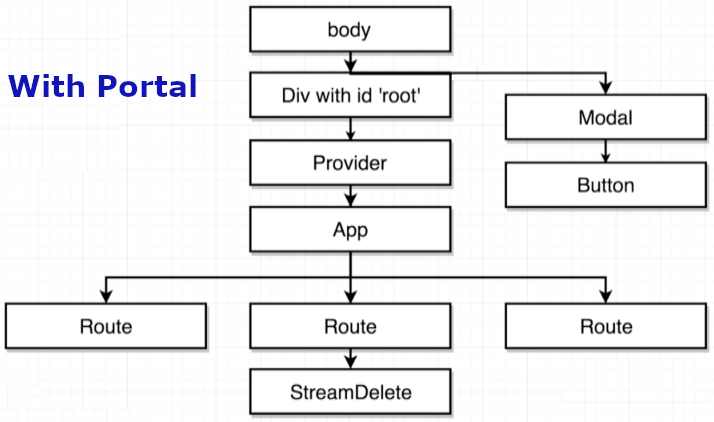
	
- To create a modal, we will use portal. Usage of portal for modal :
	- Add another div with another id to the `index.html`:
		
		```html
		<div id="root"></div>
		<div id="modal"></div>
		```
	
	- create a modal.js
	
		```javascript
		const Modal = props => {
		  return ReactDOM.createPortal(
		    <div onClick={props.onDismiss} className='ui dimmer modals visible active'>
		      <div onClick={e => e.stopPropagation()} className='ui standard modal visible active'>
		        <div className='header'>{props.title}</div>
		        <div className='content'>{props.content}</div>
		        <div className='actions'>{props.actions}</div>
		      </div>
		    </div>,
		    document.getElementById('modal')
		  );
		}
		
		export default Modal;
		```

- `React.Fragment` : it allows us to return multiple elements and it does __not__ create any div or element in real html.
	
	```javascript
	const actions = (
		<React.Fragment>
			<button className='ui button negative'>Delete</button>
			<button className='ui button'>Cancel</button>
		</React.Fragment>
	);
	```
	
	__or you can just call like that__

	```javascript
	const actions = (
		<>
			<button className='ui button negative'>Delete</button>
			<button className='ui button'>Cancel</button>
		</>
	);
	```
	
## SECTION 26 - Implementing Streaming Video
- Section entined about `flv.js` __OBS Studio__ and __Node Media Server__. Links can be accessed from extra informations given below.
	
## SECTION 27 - The Context System with React

- Difference between context system and props system:

	
	
- Flow in Props System:

	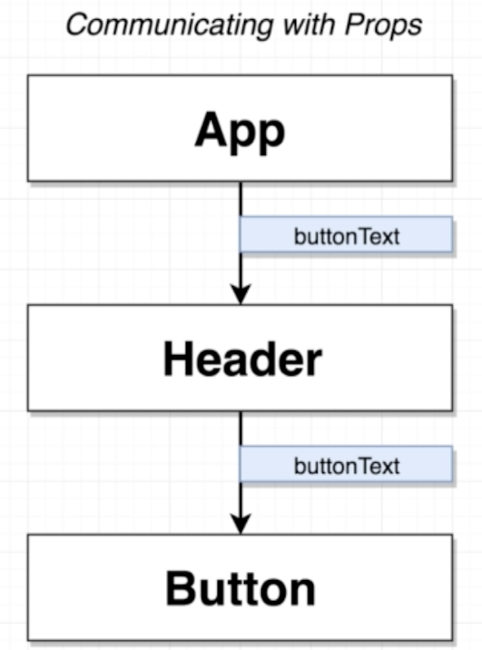

- Flow in Context System:

	

- Context System Pipe:

	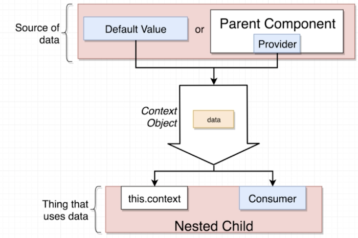
	
- How it works?

	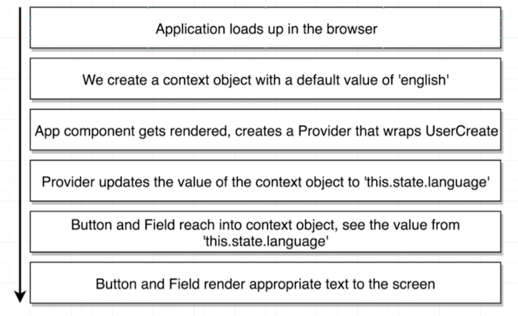
	
### Creating A Context and Usage of Context

- Need to create a javascript file and need to create context with `React.createContext ` :
	
	```javascript
	import React from 'react';
	export default React.createContext('english');
	```
	
- For use of context in any component, `static contextType` should be assigned in the component or `Context.Consumer` should be used:
	
	- First Way  -> `static contextType` : 
	
		```javascript
		import React, {Component} from 'react';
		import LanguageContext from "../contexts/LanguageContext";
		
		class Field extends Component {
		    render() {
		        const text = this.context === 'ENGLISH' ? 'Name' : 'Naam'
		        return (
		            <div className='ui field'>
		                <label>{text}</label>
		                <input/>
		            </div>
		        );
		    }
		}
		
		Field.contextType = LanguageContext;
		export default Field;
		```
		
		- __There are two ways exist for assign `contextType` :__ 
		
			```javascript
			import ANY_CONTEXT from "../contexts/ANY_CONTEXT";
			
			class Field extends Component {
			    // Some code
			}
			
			Field.contextType = ANY_CONTEXT;
			```
			
			__or__
			
			
			```javascript
			import ANY_CONTEXT from "../contexts/ANY_CONTEXT";
			
			class Field extends Component {
			    static contextType = ANY_CONTEXT
			    
			    // OTHER CODES...
			}
			
			```
	- Second Way - Using `Context.Consumer` :
		
		```javascript
		import React, {Component} from 'react';
		import LanguageContext from "../contexts/LanguageContext";
		
		class Button extends Component {
		    render() {
		        return (
		            <button className='ui button primary'>
		                <LanguageContext.Consumer>
		                    {(value) => value === 'ENGLISH' ? 'Submit' : 'Voorlagen'}
		                </LanguageContext.Consumer>
		            </button>
		        )
		    }
		}
		export default Button;
		```

	
- To change a value of context main component of context should be wrapped with `context.Provider` and `value` should be assigned (new value can be state and prop which can be changable):

	```javascript
	<Context.Provider value={newValue}>
	  <Compoent/>
	</Context.Provider>
	```
	
	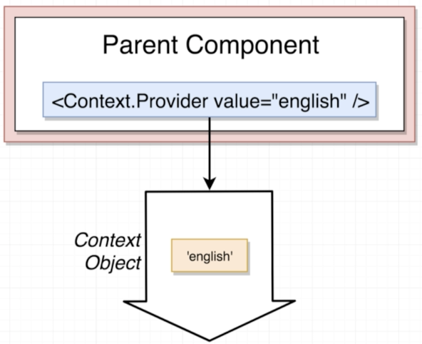
		
### Notes
- Each seperate use of `Context.Provider` creates a __new__, separate __pipe__ of information.

	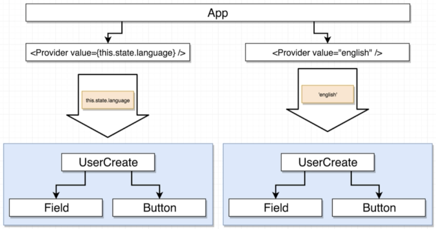

- If you not wrap your component with `Context.Provider` and not give any `value` which is using context system, it is going to use default value of `Context`.

- To use more than one context inside one component, you have to use consumer:

	__Wrapper with multiple provider__
	
	```javascript
	<LanguageContext.Provider value={this.state.language}>
	  <ColorContext.Provider value='red'>
	    <UserCreate/>
	  </ColorContext.Provider>
	</LanguageContext.Provider>
	```
	
	__Use Multiple Consumer__
	
	```javascript
	return (
		<ColorContext.Consumer>
		  {(color) =>
		    <button className={`ui button ${color}`}>
		      <LanguageContext.Consumer>
		        {(value) => value === 'ENGLISH' ? 'Submit' : 'Voorlagen'}
		      </LanguageContext.Consumer>
		    </button>
		  }
		</ColorContext.Consumer>
	)
	```
		
## SECTION 28 - Replacing Redux with Context
- Redux vs Context

	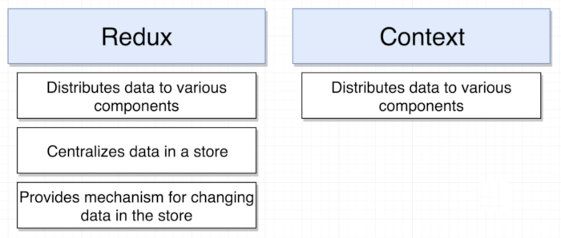
	
	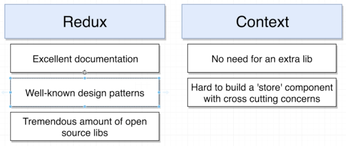
	
- Context Store Example:

	- Creating a store:
	
		```javascript
		import React, {Component} from 'react';
			
		const Context = React.createContext('ENGLISH');
			
		export class LanguageStore extends Component {
		  state = {language: 'english'};
			
		  onLanguageChange = (language) => {
		    this.setState({language})
		  }
			
		  render() {
		    return (
		      <Context.Provider value={{...this.state, onLanguageChange: this.onLanguageChange}}>
		        {this.props.children}
		      </Context.Provider>
		    );
		  }
		}
			
		export default Context;
		```	
		
	- Wrapping component:
		
		```javascript
		<LanguageStore>
		  <LanguageSelector/>
		  // Other components....
		</LanguageStore>
		```
		
	- Usage is the same with normal context:
	
		```javascript
		import React, {Component} from "react";
		import LanguageContext from '../contexts/LanguageContext'
		
		class LanguageSelector extends Component {
		  static contextType = LanguageContext;
		  render() {
		    return (
		      <div> Select language:
		        <i className='flag us' onClick={() => this.context.onLanguageChange('ENGLISH')}/>
		        <i className='flag nl' onClick={() => this.context.onLanguageChange('DUTCH')}/>
		      </div>
		    );
		  }
		}
		
		export default LanguageSelector;
		```

## [EXTRA CONTENT] Hooks with Functional Components
- Hook System

	| Name                  | Goal           | 
	|-----------------------|----------------|
	| __useState__          | Allow a functional component to use component-level state |
	| __useEffect__         | Allow a functional component to use `lifecycle methods`   |
	| __useContext__        | Allow a functional component to use the context system    |
	| __useRef__            | Allow a functional component to use the ref system        |

- Converting a class-based component to functional based component with hooks system:

	- Class based:
		
		```javascript
		import React, {Component} from "react";
		
		export default class App extends Component {
		    state = {resource: 'posts'};
		
		    render() {
		        return (
		            <div>
		                <div>
		                    <button onClick={() => this.setState({resource: 'Posts'})}>Posts</button>
		                    <button onClick={() => this.setState({resource: 'Todos'})}>Todos</button>
		                </div>
		                {this.state.resource}
		            </div>
		        );
		    }
		};
		```
		
	- Funtional based:
		
		```javascript
		import React, {useState} from "react";

		const App = () => {
		    const [resource, setResource] = useState('posts')
		    return (
		        <div>
		            <div>
		                <button onClick={() => setResource('posts')}>Posts</button>
		                <button onClick={() => setResource('todos')}>Todos</button>
		            </div>
		            {resource}
		        </div>
		    );
		};
		
		export default App;
		```
- __useState hook__ : `const [<currentValue>, <setCurrentValue>] = useState(<initialValue>);`
	- `useState` : Function from React
	- `currentValue` : contains the present value of the piece of state (same as the `this.state.SomeState`)
	- `setCurrentValue` : Function to call when we want to update our state (and rerender) (same as the `this.setState({<SomeStates>})`)
	- `initialValue` : Starting value for this piece of state, similar to when we initialized our state object

- `useState` keeps single value instead of whole state!!! To use more than one state, needs to use useState more than one.

	```javascript
	// in Class-based
	state = {
		resource: 'posts',
		count: 0
	}
	
	// in Functional-based
	const [resource, setResource] = useState('posts')
	const [count, setCount] = useState(0)
	```
- __useEffect hook__ : `useEffect(effect: EffectCallback, deps?: DependencyList): void;` 
	
	
	
	- if you dont put any `DependencyList`, `aFunction` gonna call recursively itself until user left the page!
		
		```
		useEffect(() => aFunction())
		```
		
	- if you put an empty array as `DependencyList`, `aFunction` gonna call itself just one time like `componentDidMount`.
		
		```
		useEffect(() => aFunction(), [])
		```
		
	- if you put one or more elements as array to `DependencyList`, `aFunction` gonna call itself when just given dependencies are changed. 		

		```
		useEffect(() => aFunction(), [someDependency])
		```
		
	- Example of `useEffect`:
		
		```javascript
		import React, {useEffect, useState} from "react";
		import axios from 'axios';
		
		const ResourceList = ({resource}) => {
		    const [resources, setResources] = useState([]);
		
		    const fetchResources = async (resource) => {
		        const response = await axios.get(`https://jsonplaceholder.typicode.com/${resource}`);
		        setResources(response.data);
		    }
		
		    useEffect(() => {
		        fetchResources(resource);
		    }, [resource]);
		
		    return <div>{resources.length}</div>;
		}
		
		export default ResourceList;
		```
		
- Separate hooks from the actual code :

	```javascript
	import {useEffect, useState} from "react";
	import axios from "axios";
	
	const useResources = (resource) => {
	    const [resources, setResources] = useState([]);
	
	    const fetchResources = async (resource) => {
	        const response = await axios.get(`https://jsonplaceholder.typicode.com/${resource}`);
	        setResources(response.data);
	    }
	
	    useEffect(() => {
	        fetchResources(resource);
	    }, [resource]);
	
	    return resources;
	};
	
	export default useResources;
	``` 
	
	__and usage in a component__
	
	```javascript
	import React from "react";
	import useResources from "./useResources";
	
	const ResourceList = ({resource}) => {
	    const resources = useResources(resource);
	    return <ul>
	        {resources.map(record => <li key={record.id}>{record.title}</li>)}
	    </ul>;
	}
	
	export default ResourceList;
	``` 
		
		
## COURSE PROJECTS

| Sections                  | Projects         | 
|---------------------------|------------------|
| 1 2                       | 01_helloworld    |
| 3                         | 03_components    |
| 4 5 6                     | 04_seasons       |
| 7 8 9 10                  | 07_pics          |
| 11                        | 11_videos        |
| 12                        |                  |
| 13                        |                  |
| 14                        |                  |
| 15                        |                  |
| 17                        | 17_songs         |
| 18 19                     | 18_blog          |
| 20 21 22 23 24 25 26      | 20_streams       |
| 27 28                     | 27_translate     |
| Extra                     | hooks_simple     |
| Extra                     | seasons          |


## EXTRA INFORMATIONS
- Import everything with name:
	
	```javascript
	import * as Types from './actionTypes'
	```

- Import a component with different name:

	```javascript
	import {reducer as formReducer} from 'redux-form'
	```

- Install lodash library: `npm install --save lodash` which is a modern JavaScript utility library delivering modularity, performance & extras. Some lodash informations:
	- Generally used with `_` (__underscore__)
	- `_.memoize(func, [resolver])` : Creates a function that memoizes the result of func. If resolver is provided, it determines the cache key for storing the result based on the arguments provided to the memoized function. By default, the first argument provided to the memoized function is used as the map cache key. The func is invoked with the this binding of the memoized function.

- [__Json Server__](https://www.npmjs.com/package/json-server) : Get a full fake REST API with zero coding in less than 30 seconds. Simple example steps: 
	- create directory with any name
	- run `npm init` and enter enter enter without give any thing...
	- install json-server `npm install --save json-server`
	- Create json file which will give information about fake database with any name:
	
		db.json: 
		
		```
		{
			"streams":[]
		}

		```
	- Add start script into package.json :
		
		```
		{
			"name": "api",
			"version": "1.0.0",
			"description": "",
			"main": "index.js",
			"scripts": {
				"start": "json-server -p 3001 -w db.json"
			},
			"author": "",
			"license": "ISC",
			"dependencies": {
				"json-server": "^0.16.1"
			}
		}
		```
	- Run `npm start`

- [Node Media Server](https://github.com/illuspas/Node-Media-Server) : A Node.js implementation of RTMP/HTTP-FLV/WS-FLV/HLS/DASH Media Server
- [OBS Studio](https://obsproject.com/) : Free and open source software for video recording and live streaming.
- `npm install --save flv.js` : FLV Player library : This module offers Encoder and Decoder stream classes for working with FLV media files.
- Array destructing: 

	```javascript
	const myArray = [1,3,5];
	
	const [myNum1, myNum2, myNum3] = myArray;
	console.log(myNum1); // It will print 1
	console.log(myNum2); // It will print 3
	console.log(myNum3); // It will print 5
 	```